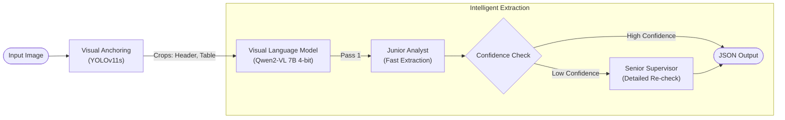

# VLM-Powered Invoice Extraction Pipeline


## 🚀 Overview

This repository hosts a high-performance **Hybrid Visual-Language Pipeline** designed to automate the extraction of critical fields from complex, noisy invoice documents.

By combining **YOLOv11** for precision visual anchoring with **Qwen-VL (4-bit)** for intelligent text extraction, this pipeline achieves accurate parsing of unstructured data (Dealers, Model Names, HP, Cost) even in challenging conditions (handwritten notes, stamps, low scan quality).

### Key Features
*   **Hybrid Architecture:** Uses Object Detection (YOLO) to "zoom in" on key areas before passing them to the Vision Language Model (VLM).
*   **Cost-Efficient:** Optimized for T4 GPUs using 4-bit quantization, running at **~$0.0012 per document**.
*   **Dual-Pass Verification:** Implements a "Junior/Senior" analyst workflow where uncertain extractions are automatically re-verified.
*   **Offline Capable:** Runs completely offline after initial setup.

---

## 🛠️ Installation

### Prerequisites
*   **GPU:** NVIDIA GPU with >= 16GB vRAM (T4, V100, A4000).
*   **Drivers:** CUDA 11.8+ installed.

### Setup
1.  **Clone the Repository:**
    ```bash
    git clone https://github.com/yourusername/invoice-extraction.git
    cd invoice-extraction
    ```

2.  **Install Dependencies:**
    We provide a strict setup script to ensure compatibility with 4-bit quantization libraries.
    ```bash
    bash setup.sh
    ```
    *Note: The script also pre-caches the Qwen-VL model weights from Hugging Face.*

---

## ⚡ Usage

The pipeline entry point is `main.py` which handles model loading, warmup, and inference.

### Process a Single Image
```bash
python main.py /path/to/invoice.jpg
```
The result is printed to the console and appended to `sample_output/result.json`.

### Process a Full Dataset (Batch Mode)
```bash
python main.py /path/to/images_folder/
```
In folder mode, the script warms up once and processes all images efficiently, saving a consolidated `result.json`.

---

## 🏗️ Architecture



### How It Works
1.  **Visual Anchoring:** YOLOv11 detects the Invoice Header, Signature, and Stamp locations.
2.  **Dynamic Zooming:** High-density regions (like the "Model Name" text) are dynamically cropped and upscaled.
3.  **VLM Inference:** The Qwen-VL model reads the visual features directly, guided by the YOLO anchors.
4.  **Guardrails:** Programmatic logic removes hallmarks (like "47 HP" appearing in the Name field) and strictly formats the JSON output.

---

## 📊 Performance & Cost

| Metric | Value |
| :--- | :--- |
| **Throughput** | ~18-20 seconds / document (on T4 GPU) |
| **Instance Cost** | ~$0.35/hour (Spot Instance) |
| **Cost Per Document** | **$0.0012 USD** |

---

## 📂 Project Structure

*   `main.py`: Main inference script.
*   `utils/`: Helper functions and YOLO weights (`best.pt`).
*   `setup.sh`: Installation script for dependencies.
*   `training/`: Notebooks for YOLO fine-tuning.
*   `demo_walkthrough.ipynb`: Jupyter notebook demonstrating the full pipeline.
*   `sample_output/`: Directory where results are saved.

---

## 🤝 Contributing
Contributions are welcome! Please feel free to submit a Pull Request.

## 📄 License
[MIT License](LICENSE)
